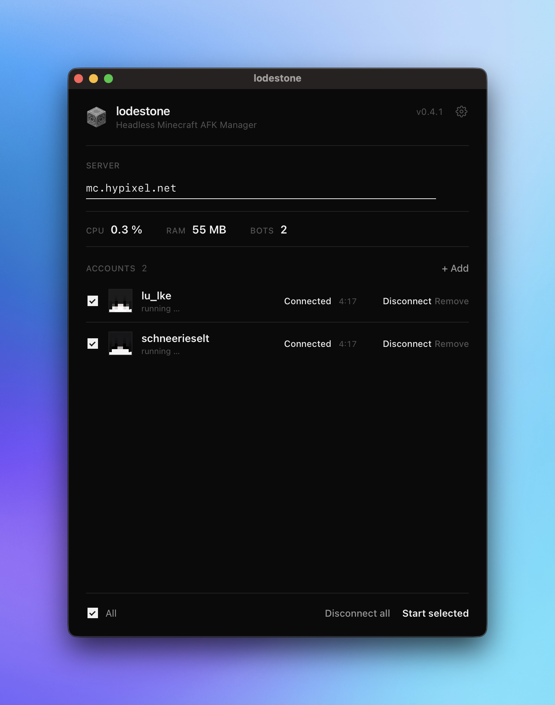

<h1 align="center">lodestone</h1>

<p align="center">
  Keep multiple Minecraft accounts online and AFK on a server. Headless,
  lightweight, and without a single game window.
</p>

<p align="center">
  
</p>

<!-- The version below is read by the app and the release tooling. -->

_Supported Minecraft version: `1.21.11`._

> [!NOTE]
> lodestone runs your accounts in the background, so they stay connected with
> minimal CPU and memory. No game client, no extra windows. You sign in once
> with Microsoft and lodestone handles the rest.

<p align="center">
  
</p>

## Features

- **Multiple accounts**: add as many Microsoft accounts as you like and keep
  them all connected at once.
- **One-time sign-in**: log in through Microsoft once per account. lodestone
  remembers it, so you never have to re-enter a password.
- **One server, one click**: set a server address and connect your selected
  accounts together, or one at a time.
- **Truly headless**: no game window, no rendering, just a quiet background
  connection per account.
- **Live overview**: see each account's status and uptime, plus real CPU and
  memory usage per account and in total.
- **Stays online**: automatic reconnect after a drop, and light anti-AFK
  movement so servers don't kick you for being idle.
- **Automatic updates**: lodestone updates itself and shows you what changed.

## Getting started

### Download

Grab the latest version for your operating system from the
[**Releases page**](https://github.com/lulkebit/lodestone/releases), then install
and open it. There's nothing else to install: the connection engine is built in.

### Use it

1. **Add an account.** Click *+ Add*. A code and a link appear: open the
   link, enter the code, and sign in with Microsoft. The window closes itself
   once you're signed in.
2. **Enter a server**, for example `mc.example.net` or `192.168.0.10:25565`.
3. **Pick the accounts** you want with the checkboxes.
4. **Start them** with *Start selected*, or connect each one individually.
   Status and uptime update live, and *Disconnect all* disconnects everyone.

## Automatic updates

lodestone checks for new versions on launch. When one is available, a banner
appears: click **Update now** and it downloads, installs, and restarts into
the new version. After updating, a **"What's new"** screen shows you what
changed. You can reopen it any time by clicking the version number in the top
right. The full history lives in the [changelog](CHANGELOG.md).

## Languages

lodestone ships in English and German. Pick your language in **Settings** (the
gear icon in the top right), where you can also check for updates.

Adding a language is just a file change. Copy `src/locales/en.json` to
`src/locales/<code>.json`, translate the values, and add one line to
`src/locales/index.json` that maps the code to a display name, for example
`"fr": "Français"`. The new language then appears in the settings dropdown.

## Your accounts & privacy

- **No passwords are ever stored.** Only the renewable tokens Microsoft issues.
- **Sign-in tokens live in your OS keychain**, not in a plaintext file: the
  macOS Keychain, the Windows Credential Manager, or the Linux Secret Service
  (GNOME Keyring / KWallet). If no keychain is reachable, lodestone falls back to
  an owner-only file in `com.lodestone.app/auth-cache/`.
- Avatars are optional. With them on, each skin head is fetched from
  mc-heads.net once and cached at `com.lodestone.app/avatars/`, so a UUID leaves
  your machine at most once. Turn them off in Settings to keep everything local.
- Everything else stays on your machine:
  - Settings (accounts, selection, server): `com.lodestone.app/config.json`

  (under `~/Library/Application Support/` on macOS, `%AppData%` on Windows, and
  `~/.config/` on Linux).

## Building from source

Want to run the latest code or contribute?

```bash
npm install        # install dependencies
npm run tauri dev  # build and launch the app
```

You'll need [Node.js](https://nodejs.org) (only for the Tauri CLI tooling) and
[Rust](https://rustup.rs) along with the usual
[Tauri prerequisites](https://v2.tauri.app/start/prerequisites/). The bot engine
([azalea](https://github.com/azalea-rs/azalea)) needs nightly Rust; the pinned
`rust-toolchain.toml` selects it automatically, so rustup installs it on first
build.

Cutting a release (maintainers): bump the version with `npm run release -- patch`
(or `minor` / `major`), fill in the [changelog](CHANGELOG.md), then commit and
push a `vX.Y.Z` tag. The GitHub Actions workflow builds and publishes the signed
release for every platform.

## How it works

lodestone is a small [Tauri](https://v2.tauri.app) desktop app. The interface
and account management are native and lightweight. The Minecraft connections are
handled in-process by [azalea](https://github.com/azalea-rs/azalea), a pure-Rust
headless client, so there is no Node.js runtime or game client to install. All
bots share the one app process, and the resource readout shows the app's total
CPU and memory.

## License

Released under the [MIT License](LICENSE).
